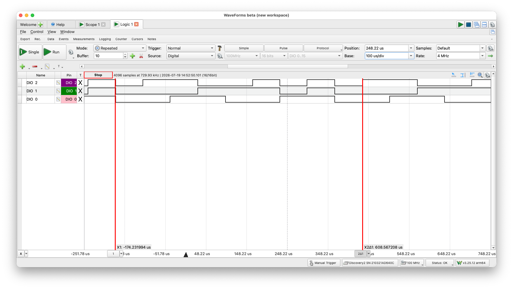
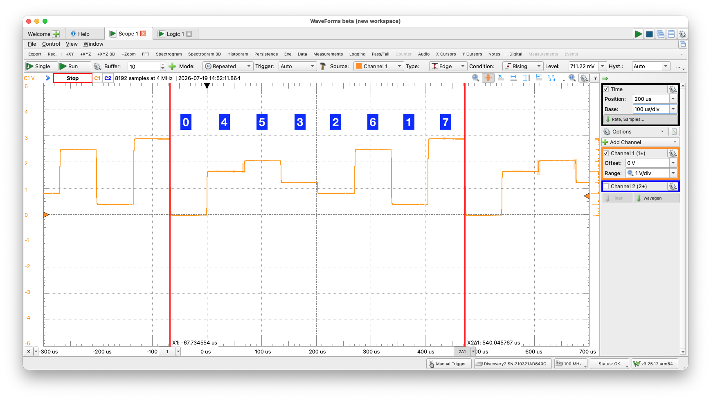

# oneline_debug
Fundamentally the same program as **oneline**, however, uses an interrupt to write which task is operating. This allows one to debug the sequence and execution time of each task.

In order to view the task execution time, view the `tasks` memory in the debugger. It will appear something like this:

```asm
─── AVR SRAM 
tasks  0x6000..0x607F
  0x6000  02 06 01 07 07 00 04 05 05 03 02 06 06 01 07 00  ................
  0x6010  00 04 05 03 03 02 06 06 01 07 00 00 04 05 03 03  ................
  0x6020  02 06 01 01 07 00 04 04 05 03 02 02 06 07 00 00  ................
  0x6030  04 05 03 03 02 06 01 01 07 00 04 04 05 03 02 02  ................
  0x6040  06 01 07 07 00 04 04 05 03 02 02 06 01 07 07 00  ................
  0x6050  04 05 05 03 02 06 06 01 07 00 00 04 05 03 03 02  ................
  0x6060  06 06 01 07 00 00 04 05 03 03 02 06 01 01 07 00  ................
  0x6070  04 04 05 03 02 02 06 01 07 07 00 04 04 05 03 02  ................
  ```

The table used to drive this execution is: (*all tasks execute in the same time*)

```asm
jump_table:
        .word   pm(task7)
        .word   pm(task1)
        .word   pm(task6)
        .word   pm(task2)
        .word   pm(task3)
        .word   pm(task5)
        .word   pm(task4)
        .word   pm(task0)
jump_table_end:
```

## Summary
Along with the table above, it is also handy to use a scope to track task execution. With the Digilent Discovery 2, there are two methods, logic analyzer and oscilloscope. For the latter, I created a resistor digital-analog-converter (DAC), which changes value based on the task executing. See [this link](https://wellys.com/posts/attiny13a_multitasking/) for more information. 

Using the logic analyzer of the scope, its clear that all of the tasks are executing appropriately.


Using a DAC R-2R ladder, we can also see that tasks are executing.
